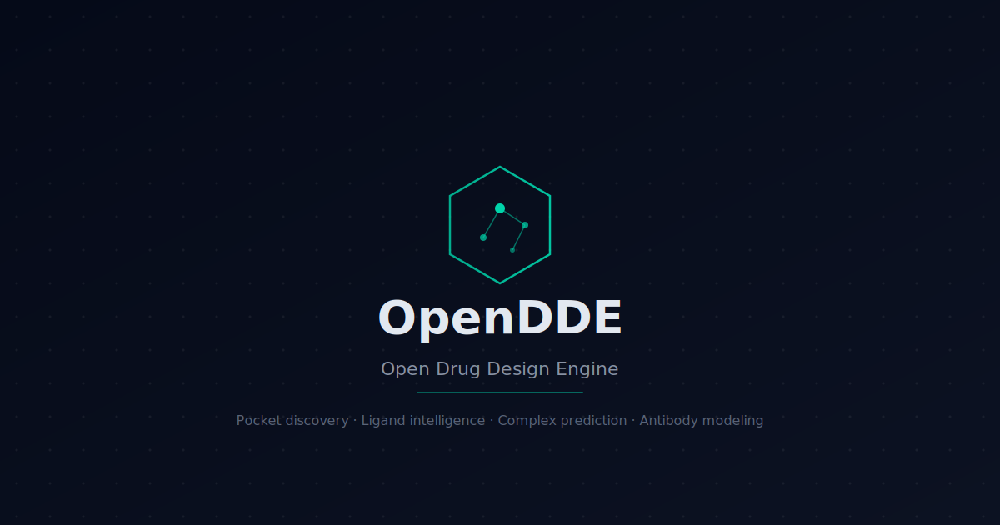

<p align="center">
  
</p>

<h1 align="center">OpenDDE — Open Drug Design Engine</h1>

<p align="center">
  <strong>Open-source computational drug design platform.</strong><br/>
  From protein target to druggability assessment in minutes — not months.
</p>

<p align="center">
  <a href="LICENSE"></a>
  
  
  
  
</p>

---

## What is OpenDDE?

OpenDDE is a self-hosted drug design workbench that chains together state-of-the-art computational biology tools into a single, cohesive workflow. Enter any protein drug target and instantly discover where drugs can bind, explore known compounds with experimental data, predict molecular interactions, and get AI-powered scientific insights — all from your browser.

The platform is designed for **academic researchers** exploring new drug targets, **pharmaceutical scientists** running computational screens, **students** learning drug design, and **biotech startups** needing professional target assessment without million-dollar software licenses. Everything runs locally via Docker Compose — no cloud GPU required, no vendor lock-in, no usage limits.

---

## Features

### Pocket Discovery
Predict druggable binding pockets on any protein using **P2Rank** machine learning. Each pocket is ranked by druggability score with detailed residue composition analysis (hydrophobic, polar, charged, aromatic ratios).

### Ligand Intelligence
Browse all known bioactive compounds from **ChEMBL** with experimental binding data (IC50, Ki, Kd). Sort by potency, filter by clinical phase, and see 2D molecular structures. Includes Lipinski Rule of Five druglikeness scoring via **RDKit**.

### Complex Prediction
Predict how drugs bind to targets using **AlphaFold 3**. Semi-automated workflow generates AF3 job files, handles upload, and renders predicted complexes in 3D with confidence metrics (iPTM, pLDDT).

### Affinity Prediction
Predict binding affinity (pIC50, IC50, binder probability) for protein-ligand pairs using **Boltz-2**. The pocket detail page shows predicted pKi alongside experimental ChEMBL values; the dedicated `/app/screen` page runs full virtual-screening campaigns across hundreds of ligands with live progress, ranked top-hits, and CSV export.

### Antibody Modeling
Predict antibody 3D structures from heavy and light chain sequences using **ImmuneBuilder**. CDR loops (H1-H3, L1-L3) are annotated and color-coded in the interactive viewer.

### AI Assistant
Claude-powered scientific assistant with full context about the current target, pockets, and ligands. Provides druggability analysis, suggests ligand modifications, explains results, and answers drug design questions.

### SAR Analysis
Structure-Activity Relationship scatter plots and automatic **activity cliff detection** — finding pairs of structurally similar molecules with dramatically different activities, revealing which chemical modifications matter most.

### Druggability Reports
Generate comprehensive target assessment reports in JSON and PDF formats. Includes pocket analysis, ligand landscape, safety signals from Open Targets, and an overall druggability score.

### Analytics Dashboard
Track exploration history with charts and metrics: targets explored over time, pocket score distributions, ligand activity ranges, and top targets by compound count.

### Additional Features
- **Pocket comparison** radar charts across multiple pockets
- **Similar target discovery** via sequence homology
- **Safety profiles** from Open Targets
- **CSV/PDF export** for all data
- **Command palette** (Cmd+K) for quick navigation
- **Dark/light theme** toggle

---

## Quick Start

### Prerequisites

- [Docker Desktop](https://www.docker.com/products/docker-desktop/) v4.0+
- 8 GB RAM minimum (16 GB recommended)
- Git

### Installation

```bash
# Clone the repository
git clone https://github.com/your-org/opendde.git
cd opendde

# Set up environment variables
cp .env.example .env
# Edit .env with your Supabase URL/key and optional API keys

# Build and start all services
docker compose up --build

# Open in browser
open http://localhost:3000
```

First build takes 5–10 minutes (downloading Docker images). Subsequent starts take ~30 seconds.

### Search your first target

1. Click **"Launch app"** on the homepage
2. Type `EGFR` or `P00533` in the search bar
3. Explore the 3D structure, binding pockets, and known compounds
4. Click any pocket to see residue analysis and ligand data

---

## Architecture

```
┌─────────────────────────────────────────────────────────┐
│                    Docker Compose                       │
│                                                         │
│  ┌──────────┐    ┌──────────┐    ┌──────────────────┐  │
│  │ Frontend  │───▶│ Backend  │───▶│  Microservices   │  │
│  │ Next.js   │    │ FastAPI  │    │                  │  │
│  │ :3000     │    │ :8000    │    │  P2Rank  :5001   │  │
│  └──────────┘    │          │    │  RDKit   :5002   │  │
│                  │          │───▶│  Immune  :5003   │  │
│                  │          │    └──────────────────┘  │
│                  │          │                           │
│                  │          │───▶ Redis :6379           │
│                  │          │───▶ Supabase (external)   │
│                  │          │───▶ ChEMBL API            │
│                  │          │───▶ UniProt API           │
│                  │          │───▶ Claude API            │
│                  └──────────┘                           │
└─────────────────────────────────────────────────────────┘
```

| Service | Port | Technology | Purpose |
|---------|------|------------|---------|
| **frontend** | 3000 | Next.js 14 | React UI with App Router |
| **backend** | 8000 | FastAPI | REST API, orchestration, caching |
| **p2rank** | 5001 | Java + Flask | ML pocket prediction |
| **rdkit** | 5002 | Python + RDKit | Molecular properties, similarity |
| **immunebuilder** | 5003 | Python + PyTorch | Antibody structure prediction |
| **redis** | 6379 | Redis 7 | Response caching |

---

## Documentation

Full documentation is available at [localhost:3000/docs](http://localhost:3000/docs) when the platform is running.

- **Getting Started** — Introduction, quick start, system requirements, Docker setup
- **Features** — Pocket discovery, ligand intelligence, complex prediction, antibody modeling, AI assistant, druglikeness scoring, reports, SAR analysis
- **Architecture** — System overview, engine swap layer, microservices, database schema, API reference (35 endpoints)
- **Contributing** — Development setup, adding new engines, code structure, PR guide

Educational content is available at [localhost:3000/learn](http://localhost:3000/learn):

- **Drug Discovery 101** — Complete beginner's guide to how medicines are found
- **How OpenDDE Works** — Technical overview of every feature
- **Understanding Proteins** — Visual guide to protein structure and AlphaFold
- **From Target to Drug** — Step-by-step EGFR walkthrough

---

## For Researchers

OpenDDE accelerates the early stages of drug discovery — target assessment, pocket identification, and compound landscape analysis. Tasks that traditionally require expensive commercial software and weeks of manual work can be completed in minutes using freely available, state-of-the-art tools.

The platform is particularly valuable for researchers working on understudied targets ("dark" proteome), where limited prior data makes commercial databases less useful. By combining AlphaFold structure predictions with P2Rank pocket analysis and ChEMBL compound data, OpenDDE provides a comprehensive druggability assessment for any human protein — even those with no experimental crystal structure.

---

## Engine Swap Architecture

OpenDDE is designed with a modular **engine swap** pattern. Each computational tool is accessed through a standardized adapter interface, making it trivial to replace any engine as better alternatives emerge:

```python
class PocketEngine(ABC):
    @abstractmethod
    async def predict(self, structure_path: str) -> list[Pocket]:
        ...

class P2RankEngine(PocketEngine):
    async def predict(self, structure_path: str) -> list[Pocket]:
        response = await httpx.post(f"{self.url}/predict", ...)
        return self._parse(response.json())

# Swap in a different engine with zero router changes
class FPocketEngine(PocketEngine):
    ...
```

| Function | Current Engine | Possible Alternatives |
|----------|---------------|----------------------|
| Pocket prediction | P2Rank | FPocket, DeepSite, SiteMap |
| Structure prediction | AlphaFold 3 | Boltz-2, Chai-1, ESMFold |
| Affinity prediction | Boltz-2 | DiffDock, FEP+, AutoDock-GPU |
| Antibody modeling | ImmuneBuilder | ABodyBuilder3, IgFold |
| Cheminformatics | RDKit | OpenBabel, CDK |

### Using a remote GPU for Boltz-2

Local CPU inference takes 3–8 minutes per prediction, which is fine for trying things out but slow for real screening. For production use or large-scale screens, set `BOLTZ_SERVICE_URL` in `.env` to an endpoint running the same API on a GPU instance and the rest of the platform just works:

```bash
# .env
BOLTZ_SERVICE_URL=https://my-boltz-gpu.example.com
```

Compatible options:

- **NVIDIA Boltz2 NIM** — drop-in API, fastest path to production-grade throughput.
- **Self-hosted** — run the bundled `services/boltz` container on a GPU VM (AWS g5.xlarge, Lambda Labs A10, etc.) with `TORCH_VARIANT=cu121`.
- **Modal / Replicate / Runpod** — wrap the same service entrypoint in any of these serverless GPU platforms.

The frontend warmup banner and `/affinity/health` endpoint surface model-cache state regardless of where the service runs.

---

## Roadmap

- [x] **Boltz-2 integration** — Affinity prediction shipped in v3.2.0
- [x] **Batch screening** — `/app/screen` campaign runner shipped in v3.2.0
- [ ] **AutoDock Vina** — Local molecular docking without AlphaFold Server dependency
- [ ] **Collaborative features** — Shared workspaces and annotation
- [ ] **IsoDDE integration** — When API access becomes available
- [ ] **Protein-protein interaction** druggability analysis
- [ ] **ADMET prediction** — Absorption, distribution, metabolism, excretion, toxicity

---

## Contributing

We welcome contributions! See [CONTRIBUTING.md](CONTRIBUTING.md) for detailed guidelines.

### Quick start for developers

```bash
# Clone and install
git clone https://github.com/your-org/opendde.git
cd opendde

# Start with hot reload
docker compose up --build

# Frontend: http://localhost:3000 (Next.js Fast Refresh)
# Backend: http://localhost:8000 (Uvicorn --reload)
```

### Areas to contribute

- **New engines** — Integrate Boltz-2, AutoDock Vina, or other tools
- **Visualization** — Improve 3D viewer, add new chart types
- **Documentation** — Expand guides, add tutorials
- **Testing** — Unit and integration tests
- **Accessibility** — Keyboard navigation, screen reader support

---

## Citation

If you use OpenDDE in your research, please cite:

```bibtex
@software{opendde2026,
  title     = {OpenDDE: Open Drug Design Engine},
  author    = {Ajmal},
  year      = {2026},
  url       = {https://github.com/your-org/opendde},
  license   = {MIT},
  note      = {Open-source computational drug design platform}
}
```

---

## Acknowledgments

OpenDDE integrates and builds upon the work of many open-source projects and research teams:

| Tool | Organization | What it provides |
|------|-------------|-----------------|
| [AlphaFold 3](https://alphafold.ebi.ac.uk/) | Google DeepMind | Structure prediction & complex modeling |
| [P2Rank](https://github.com/rdk/p2rank) | Czech Technical University | ML-based binding pocket detection |
| [ChEMBL](https://www.ebi.ac.uk/chembl/) | EMBL-EBI | Bioactivity data for drug-like molecules |
| [RDKit](https://www.rdkit.org/) | Open-source community | Cheminformatics toolkit |
| [ImmuneBuilder](https://github.com/oxpig/ImmuneBuilder) | Oxford Protein Informatics | Antibody structure prediction |
| [UniProt](https://www.uniprot.org/) | UniProt Consortium | Protein knowledge base |
| [PubChem](https://pubchem.ncbi.nlm.nih.gov/) | NCBI / NIH | Chemical compound data |
| [Claude](https://www.anthropic.com/) | Anthropic | Scientific reasoning & analysis |
| [Open Targets](https://www.opentargets.org/) | EMBL-EBI / Wellcome Sanger | Safety profile data |

Inspired by [Isomorphic Labs' IsoDDE](https://www.isomorphiclabs.com/articles/isodde-a-new-era-for-drug-design), which demonstrated that AI-first drug design can more than double the accuracy of existing methods. OpenDDE is an independent, community-built project and is not affiliated with Isomorphic Labs or Google DeepMind.

---

## License

[MIT](LICENSE) — Use, modify, and distribute freely.

Built with love by **Ajmal**.
